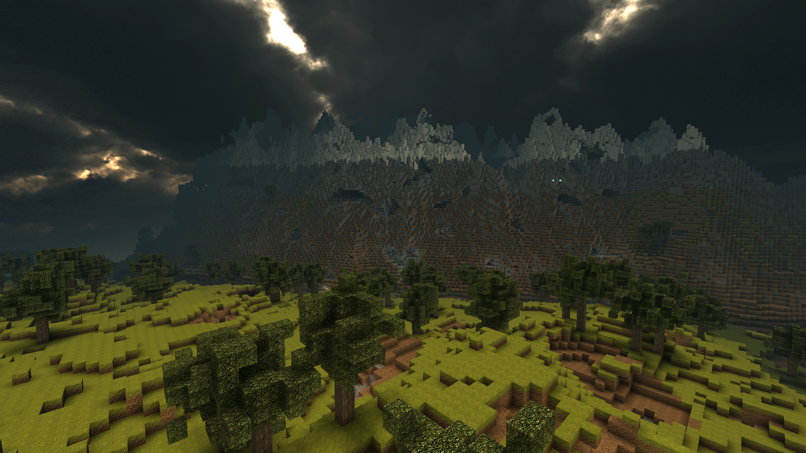
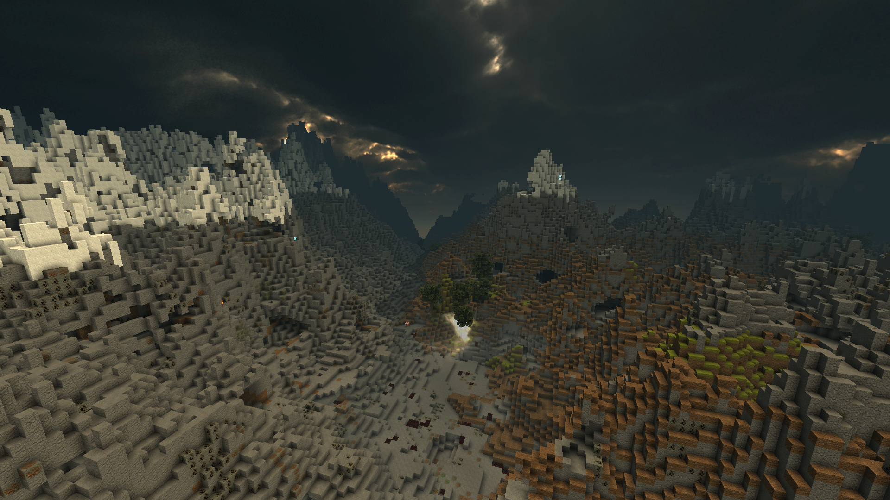
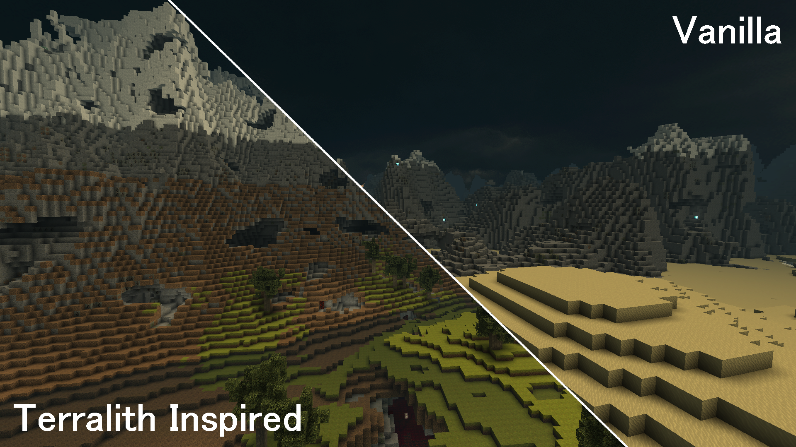

# Terralith Inspired Biomes



> A Terralith-inspired world generation project for CastleForge and WorldGenPlus focused on dramatic mountains, towering cliffs, deep valleys, and biome-driven terrain.

---

## Overview

**Terralith Inspired Biomes** is a custom world generation project built for the CastleForge ecosystem using **WorldGenPlus**.

The goal of this project is to push CastleMiner Z terrain generation toward a more dramatic, hand-crafted look inspired by large-scale biome overhauls like Terralith, while still feeling natural as a generated world. Instead of relying on a flatter average terrain height, this project keeps the base world level low so more of the vertical build space can be used for massive cliffs, sharp ridgelines, deep basins, and towering alpine peaks.

If you want worlds that feel more cinematic, more vertical, and more explorable than standard terrain generation, this project is meant to provide that.

---

## What this project includes

This repository currently focuses on custom biome and terrain generation for WorldGenPlus, with emphasis on:

- low average terrain baselines for greater vertical contrast
- dramatic cliff walls and sharp mountain ridges
- deep valleys, basins, and cut-through terrain transitions
- biome-driven regional variation instead of one uniform heightmap
- presets tuned for different levels of terrain intensity
- a Terralith-inspired style that favors scenic, extreme landscapes

### Terrain style highlights

The intended terrain style includes features such as:

- **towering mountains** with jagged crowns and steep faces
- **large cliff bands** with exposed rock walls and shelf-like formations
- **deep lowlands and valleys** to make high elevations feel even larger
- **strong elevation contrast** between neighboring regions
- **explorable biome transitions** instead of flat or repetitive terrain
- a world silhouette that looks dramatic from long distances

---

## Why this project stands out

- **Built around vertical drama** — the terrain is designed to feel tall, steep, and scenic.
- **Low base world level** — more of the world height budget is reserved for cliffs and mountains.
- **Preset-driven generation** — different presets can push the world toward mixed regions, huge clifflands, or extreme peak generation.
- **Made for WorldGenPlus** — this project is designed to extend a CastleForge-compatible world generation workflow rather than replacing files manually.
- **Inspired by large biome overhauls** — the focus is not just noise variation, but memorable terrain shapes.

---

## Intended world style

The overall design goal is to create worlds that feel like:

- alpine and subalpine mountain ranges
- giant cliff basins and broken escarpments
- harsh ridgeline terrain with dramatic silhouettes
- expansive scenic worlds that look good both up close and at a distance

This project is especially aimed at players who want terrain that feels more like a showcase seed or custom survival map than a conventional procedural world.

---

## Installation

### Requirements

You need the CastleForge-compatible **WorldGenPlus** setup installed and working in your CastleMiner Z environment.

### Install steps

1. Install CastleForge and the required **WorldGenPlus** framework or project dependency.
2. Download this repository or its release archive.
3. Add the included world generation files to the location expected by your WorldGenPlus setup.
4. Rebuild or load the project, depending on how your setup handles WorldGenPlus extensions.
5. Generate a new world using one of the included presets.

---

## Presets

Depending on the current release, this project may include multiple presets tuned for different terrain styles.

Examples of the intended preset roles:

- **Mixed Regions** — a balanced preset with varied terrain regions
- **Single Cliffs** — favors cliff-heavy landscapes across more of the world
- **Extreme Peaks** — pushes mountain height and sharper ridgelines
- **Skybreakers** — the most aggressive option for towering terrain
- **Cataclysmic Regions** — mixes multiple extreme terrain profiles together

If you include multiple presets in the repository, call out exactly what each one is for so users know which world style to start with.

---

## Project structure

```text
TerralithInspiredBiomes/
├─ Assets/
│  ├─ Preview.png
│  ├─ WorldShowcase.png
│  └─ PresetShowcase.png
├─ Source/
│  └─ TerralithInspiredBiomes.cs
├─ Presets/
│  ├─ WorldGenPlus.TerralithInspiredBiomes.MixedRegions.ini
│  ├─ WorldGenPlus.TerralithInspiredBiomes.SingleCliffs.ini
│  ├─ WorldGenPlus.TerralithInspiredBiomes.ExtremePeaks.ini
│  ├─ WorldGenPlus.TerralithInspiredBiomes.Skybreakers.ini
│  └─ WorldGenPlus.TerralithInspiredBiomes.CataclysmicRegions.ini
└─ README.md
````

### Folder notes

#### `Source/`

Contains the biome generation logic, terrain shaping code, and world-gen behavior.

#### `Presets/`

Contains the preset configurations that tune how intense, varied, or extreme the generated terrain should be.

#### `Assets/`

Contains preview images and showcase screenshots used for GitHub and catalog pages.

---

## Visual highlights

| Preview                                        | What it demonstrates                                                            |
| ---------------------------------------------- | ------------------------------------------------------------------------------- |
|             | **Main terrain preview** — the overall Terralith-inspired look and world style. |
|  | **In-world generation** — cliffs, peaks, valleys, and region transitions.       |
|   | **Preset comparison** — how different terrain presets change world intensity.   |

---

## Notes

* This project is intended to be documented and released as a **world generation project**, not as a standard gameplay mod or texture pack.
* Terrain generation may be more extreme than vanilla-style worlds, depending on the preset used.
* Some presets may intentionally trade flatter building space for more dramatic world shapes.
* This project is best used when generating a **new world**, since the terrain style is part of world creation.

---

## Future improvements

Future directions for this project:

* biome-specific surface materials and decoration logic
* more distinct regional generation themes
* dedicated alpine, canyon, or shattered-land presets
* improved cave integration to match the surface drama

---

## Credits

### Project concept and development

* **RussDev7**

### Framework used

* **CastleForge**
* **WorldGenPlus**

### Inspiration

* Large-scale biome and terrain overhaul projects such as **Terralith**

---

## License

This project is open source and licensed under the **GPL-3.0**.

See the repository [LICENSE](LICENSE) file for full details.
